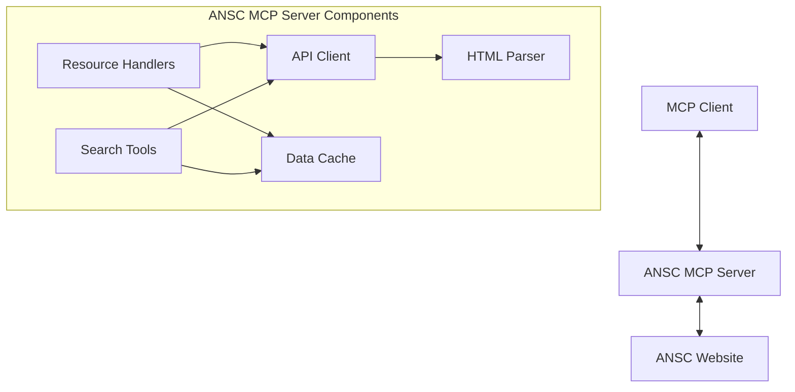

# ANSC MCP Server Architecture

## System Overview



## Phase 1 Implementation Scope

### Core Features (To Be Implemented)

1. Search Tools
   - search_appeals
     * Parameters:
       - year (optional): number (defaults to current year)
       - authority (optional): string
       - challenger (optional): string
       - procedureNumber (optional): string (OCDS ID)
       - status (optional): AppealStatus
     * Returns: Array of Appeal objects
   
   - search_decisions
     * Parameters:
       - year (optional): number (defaults to current year)
       - authority (optional): string
       - challenger (optional): string
       - procurementObject (optional): string
       - decisionStatus (optional): DecisionStatus[]
       - decisionContent (optional): DecisionContent[]
       - appealGrounds (optional): AppealGrounds[]
       - complaintObject (optional): ComplaintObject
       - appealNumber (optional): string
     * Returns: Array of Decision objects

### Future Features (Documented for Later Implementation)

2. Fetch Tools (Future)
   - get_appeal_details
   - get_decision_pdf

3. Analysis Tools (Future)
   - analyze_appeal
   - analyze_decision
   - find_related_appeals

4. Integration Tools (Future)
   - get_tender_appeals
   - analyze_tender_appeal_history

## Data Models

```typescript
// Appeal Interface
interface Appeal {
  registrationNumber: string;  // e.g. '02/279/25'
  entryDate: string;          // e.g. '13/03/2025'
  exitNumber: string;
  challenger: string;
  contractingAuthority: string;
  complaintObject: string;
  procedureNumber: string;     // OCDS ID e.g. 'ocds-b3wdp1-MD-1740472744894'
  procedureType: string;
  procurementObject: string;
  status: AppealStatus;
}

// Decision Interface
interface Decision {
  date: string;
  challenger: string;
  contractingAuthority: string;
  complaintObject: string;
  pdfUrl: string;             // e.g. 'https://elo.ansc.md/DownloadDocs/DownloadFileServlet?id=103491'
  reportingStatus: string;    // Free text status
}

// Search Parameters
interface AppealSearchParams {
  year?: number;              // Optional, defaults to current year
  authority?: string;
  challenger?: string;
  procedureNumber?: string;   // OCDS ID
  status?: AppealStatus;
}

interface DecisionSearchParams {
  year?: number;              // Optional, defaults to current year
  authority?: string;
  challenger?: string;
  procurementObject?: string;
  decisionStatus?: DecisionStatus[];
  decisionContent?: DecisionContent[];
  appealGrounds?: AppealGrounds[];
  complaintObject?: ComplaintObject;
  appealNumber?: string;
}

// Enums
enum AppealStatus {
  Withdrawn = 1,
  CanceledNumber = 2,
  UnderReview = 3,
  DecisionAdopted = 4,
  // ... (all other statuses as provided)
}

enum DecisionStatus {
  InForce = 1,
  CanceledByCourt = 2,
  SuspendedByCourt = 3
}

enum DecisionContent {
  ComplaintUpheld = 1,
  ProcedureCanceled = 2,
  ProcedurePartiallyCanceled = 3,
  // ... (all other content types as provided)
}

enum ComplaintObject {
  AwardDocumentation = 1,
  ProcedureResults = 6
}
```

## Project Structure

```
ansc-server/
├── src/
│   ├── index.ts                  # Main entry point
│   ├── api/
│   │   └── ansc-client.ts        # ANSC API client
│   ├── models/
│   │   ├── appeals.ts            # Appeal interfaces
│   │   └── decisions.ts          # Decision interfaces
│   ├── handlers/
│   │   ├── resources.ts          # Resource handlers
│   │   ├── tools.ts              # Search tools
│   │   └── utils.ts              # Shared utilities
│   └── utils/
│       ├── html-parser.ts        # HTML table parsing
│       └── error-handler.ts      # Error handling
├── package.json
└── tsconfig.json
```

## Technical Implementation Details

### HTML Parsing Strategy
- Use cheerio for efficient HTML parsing
- Create robust selectors for table data extraction:
  * Appeals table: #myTable
  * Decisions table: #myTable
- Handle pagination and empty results

### Default Year Handling
- Both search tools will use the current year if no year is provided
- Year handling utility function:
```typescript
function getSearchYear(year?: number): number {
  return year || new Date().getFullYear();
}
```

### Error Handling
- Network errors (ANSC site down)
- Invalid search parameters
- HTML structure changes
- Rate limiting

### Performance
- Implement caching for frequently accessed data
- Use connection pooling for HTTP requests
- Optimize HTML parsing
- Handle concurrent requests efficiently

## Dependencies
- @modelcontextprotocol/sdk
- axios
- cheerio
- node-cache

## Configuration
```typescript
interface AnscConfig {
    baseUrl: string;
    cacheTimeout: number;
    maxConcurrent: number;
    retryAttempts: number;
}
```

This revised architecture focuses on implementing the core search functionality with default year handling, while maintaining documentation for future features. The implementation will prioritize robust HTML parsing, error handling, and efficient data retrieval for the search tools.